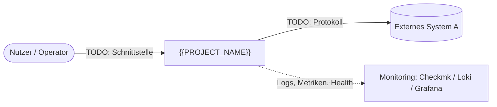
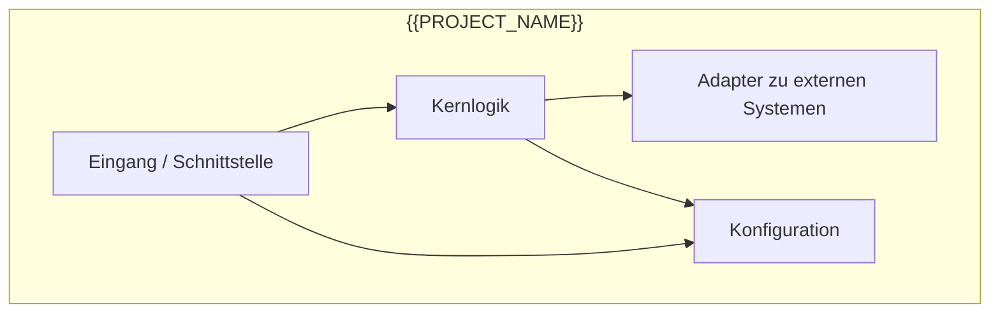
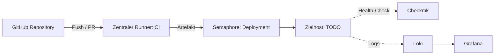

# Architektur – {{PROJECT_NAME}}

Stand: {{DATE}} · Verantwortlich: Architect (Planungs-Thread) · Freigabe G1: TODO(kickoff)

Die Struktur folgt einer verkürzten Fassung von arc42. Abschnitte, die für dieses Projekt nicht zutreffen, bleiben stehen und werden mit „n/a, weil …“ begründet, damit erkennbar ist, dass sie geprüft wurden.

Die Architekturbilder in Abschnitt 3, 5 und 7 sind Mermaid-Diagramme. GitHub und VS Code (mit Mermaid-Erweiterung) rendern sie direkt. Sie sind Teil des Codes: Jede Änderung der Klasse L und jede Änderung an Bausteinen, Schnittstellen oder Verteilung aktualisiert das betroffene Diagramm im selben Pull Request. Ein Diagramm, das nicht zum Code passt, ist ein Fehler wie jeder andere.

## 1. Ziele und Anforderungen

TODO(kickoff): Was soll das System leisten, für wen, und woran wird Erfolg gemessen? Funktionale Kernanforderungen und die drei bis fünf wichtigsten Qualitätsziele (zum Beispiel Verfügbarkeit, Nachvollziehbarkeit, Wartbarkeit) mit messbarem Kriterium.

| Qualitätsziel | Kriterium | Priorität |
|---|---|---|
| TODO | TODO | 1 |

## 2. Randbedingungen

TODO(kickoff): Technische, organisatorische und rechtliche Vorgaben. Beispiele: vorgegebene Runner, Zielplattform, vorhandene Monitoring-Landschaft (Checkmk, Loki, Grafana), Deployment über Semaphore, Datenschutz, Budget.

## 3. Kontext

Mit welchen Menschen und Systemen interagiert das System, und über welche Schnittstellen?

| Partner | Richtung | Schnittstelle | Zweck |
|---|---|---|---|
| TODO | ein/aus | TODO | TODO |

## 4. Lösungsstrategie

TODO(kickoff): Die grundlegenden Entscheidungen in wenigen Sätzen, jeweils mit Verweis auf das ADR. Zum Beispiel Wahl der Sprache (ADR-0002), Datenhaltung, Integrationsmuster.

## 5. Bausteinsicht

Zerlegung des Systems in Komponenten und ihre Abhängigkeiten.

| Baustein | Verzeichnis | Verantwortung |
|---|---|---|
| TODO | `TODO/` | TODO |

## 6. Laufzeitsicht

TODO: Die zwei oder drei wichtigsten Abläufe, gern als Mermaid-Sequenzdiagramm, sobald sie feststehen. Pflicht für jeden Ablauf mit mehr als zwei beteiligten Komponenten oder mit Fehlerbehandlung über Systemgrenzen hinweg.

## 7. Verteilung und Betrieb

Wo läuft was, wie kommt es dorthin, und wie wird es überwacht?

Details zum Betrieb stehen im Runbook unter `docs/operations/RUNBOOK.md`.

## 8. Querschnittliche Konzepte

Jedes Konzept wird kurz beschrieben oder mit „n/a, weil …“ begründet.

Konfiguration: TODO – ausschließlich über Umgebungsvariablen oder Konfigurationsdatei außerhalb des Repos, Beispiel in `.env.example`.

Logging: TODO – strukturiert (JSON) auf stdout, Felder mindestens `timestamp`, `level`, `message`, `component`, damit Loki ohne Parser-Sonderregeln auswerten kann. Keine Secrets oder personenbezogenen Daten in Logs.

Monitoring: TODO – wie stellt Checkmk fest, dass der Dienst gesund ist (Health-Endpunkt, Local Check, Prozessüberwachung)? Welche Metriken gehen nach Grafana?

Fehlerbehandlung: TODO – wie werden Fehler gemeldet, wiederholt, eskaliert?

Security: TODO – Authentifizierung, Autorisierung, Umgang mit Secrets. Details in `docs/security/THREAT_MODEL.md`.

Backup und Wiederherstellung: TODO – welche Daten, wie oft, wie getestet?

## 9. Risiken und technische Schulden

| Risiko / Schuld | Auswirkung | Gegenmaßnahme | Arbeitspaket |
|---|---|---|---|
| TODO | TODO | TODO | TODO |
